# Laporan Resmi Praktikum Modul 1

Praktikum Modul 1 mata kuliah Jaringan Komputer berisi cara *Crimping* dan *Filter* pada *Wireshark*. Saat *Crimping*, diberi waktu 10 menit untuk membuat jenis kabel, yaitu *Straight* dan *Cross*. Untuk *Filter* pada *Wireshark*, menggunakan *Capture Filter* dan *Display Filter*.

## Capture Filter

Untuk *Capture Filter*, menggunakan bagian seperti gambar dibawah ini pada *Wireshark*.
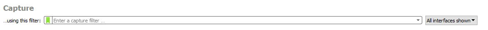
 Ada 5 soal yang disajikan, yaitu:
 1. Filter sehingga wireshark hanya mengambil paket yang mengandung port 21
 	
 	**Jawab**:
	
	Pada *Capture Filter* ketik `tcp port 21`. Paket akan muncul ketika kita membuka *FIlezila*. Karena sedang tidak membukanya, maka tampilan hanya seperti berikut:

	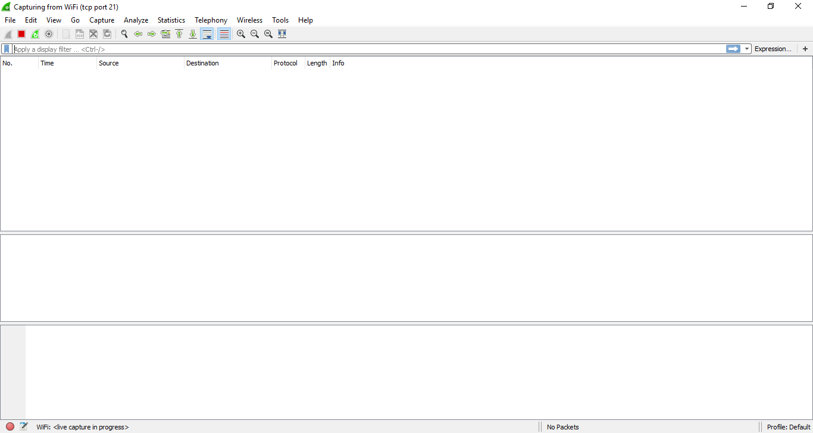

 2. Filter sehingga wireshark hanya mengambil paket yang berasal dari port 80 (ajk.if.its.ac.id)
	
	**Jawab**:

	Masukkan `src port 80`. Setelah itu buka [ajk.if.its.ac.id](ajk.if.its.ac.id). Tampilan pada *Wireshark* akan seperti dibawah ini:

	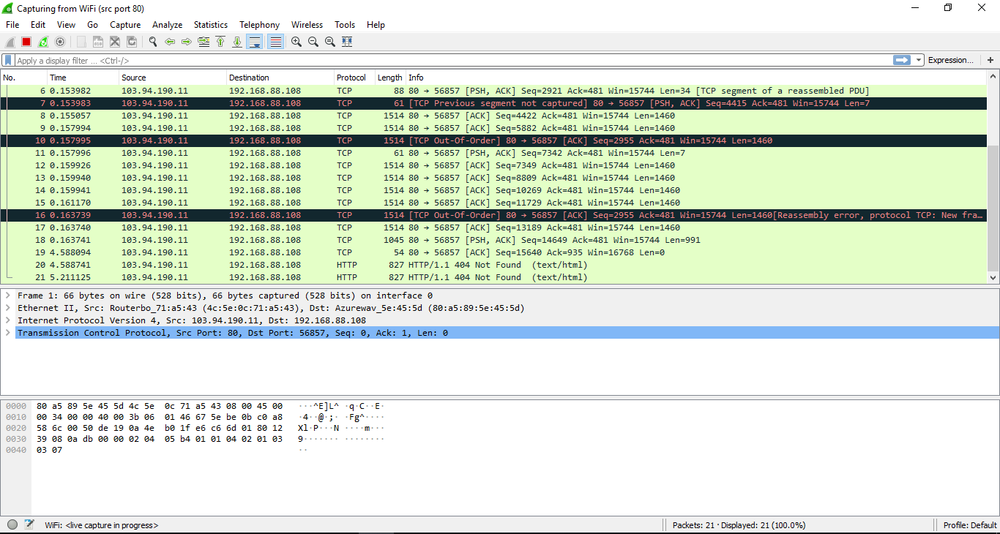
 
 3. Filter sehingga wireshark hanya menampilkan paket yang menuju port 443 (google.com)
	
	**Jawab**:

	Ketik `dst port 443`. Dalam soal, untuk mengetes menggunakan [google.com](google.com). Tetapi saat kami menjalankannya, kami telah membuka [youtube.com](youtube.com) dan [stackedit.io](stackedit.io). *Wireshark* menampilkan seperti ini:

	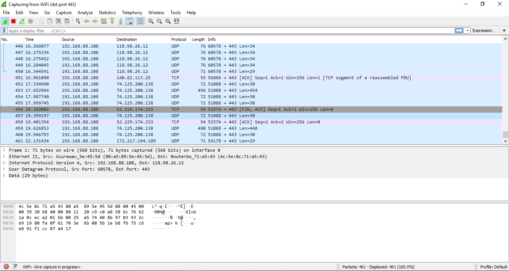

 4. Filter sehingga wireshark hanya mengambil paket yang berasal dari ip kalian
	
	**Jawab**:
	
	Pertama mencari IP dengan `ipconfig` pada *command promt*. 

	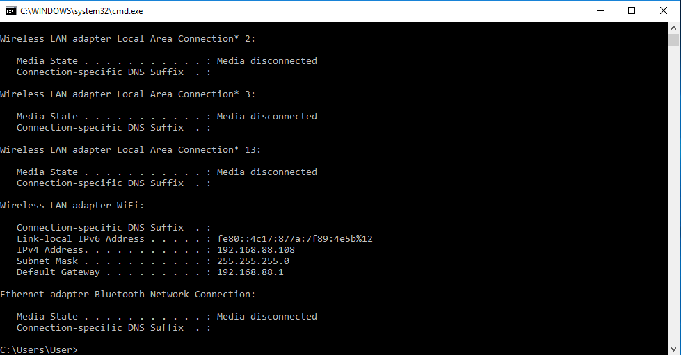

	Diketahui IP kami `192.168.88.108`. Kemudian pada *Wireshark* ketik `ip src 192.168.88.108`. Hasilnya seperti dibawah ini:

	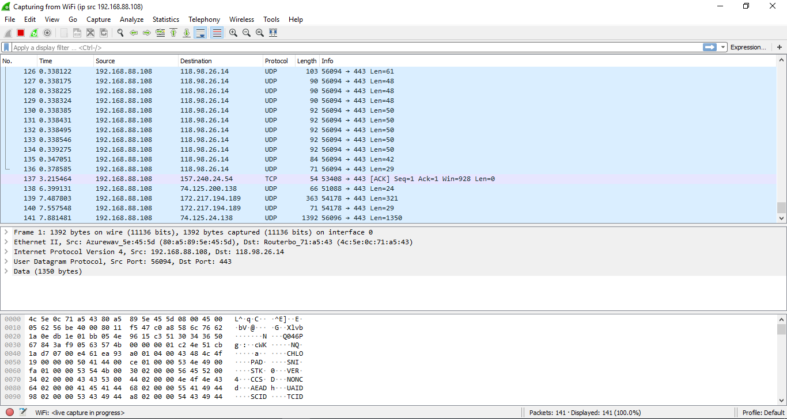

 5. Filter sehingga wireshark hanya mengambil paket yang tujuannya ke monta.if.its.ac.id
	
	**Jawab**:

	Ketik `dst host monta.if.its.ac.id`. Kemudian buka [monta.if.its.ac.id](monta.if.its.ac.id). Hasil akan seperti berikut:

	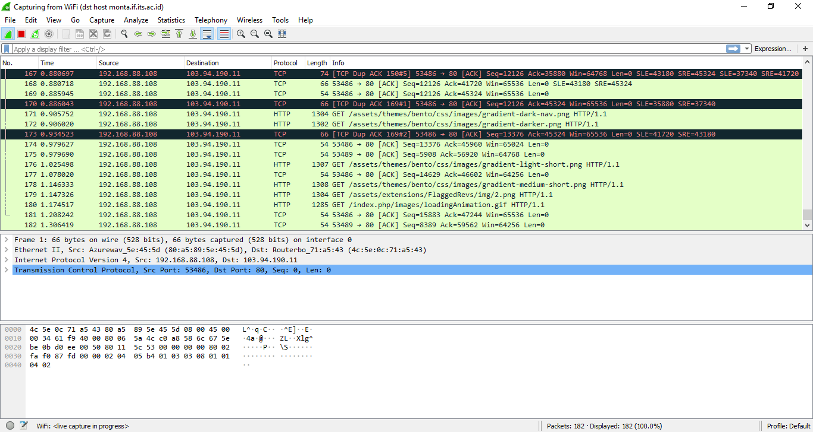

## Display Filter

*Display Filter* pada praktikum kali ini telah disediakan file *Wireshark* untuk menjawab 15 soal yang telah diberikan. Pertama buka file `no1-no15.pcapng` di *Wireshark*. Tampilan akan seperti gambar dibawah ini.

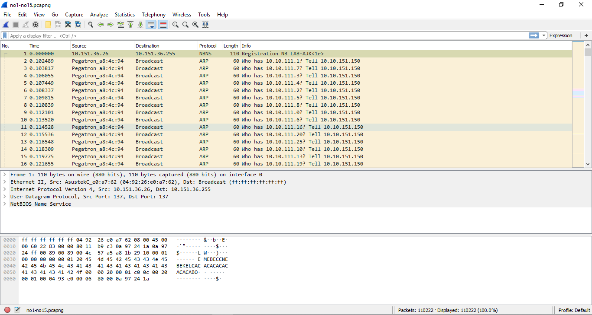

Kemudian kita menjawab sesuai perintah soal menggunakan *Display Filter*.

**Soal**
1.  Tampilkan semua paket yang hostnya mengandung "www.ne.its.ac.id"
	
	**Jawab**:

	Pada *Display Filter* ketik `http.host ==  "www.ne.its ac.id"`. Hasilnya seperti berikut:

	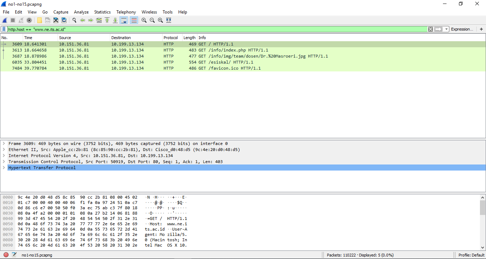

    
2.  Tampilkan paket yang hanya berasal dari IP 10.151.36 81 dan menuju web "mb.its.ac.id"
	
	**Jawab**:

	Menggunakan *syntax* `ip.src == 10.151.36.81 && http.host == "mb.its.ac.id"`. `ip.src == 10.151.36.81` untuk yang berasal IP tersebut dan `http.host == "mb.its.ac.id"` untuk menuju web tersebut. Maka muncul:

	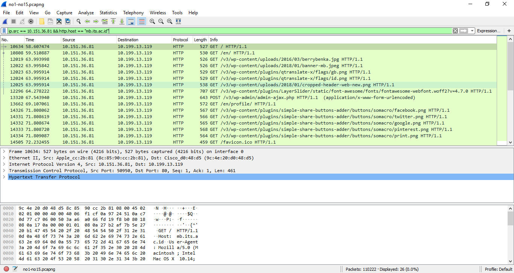

    
3.  Simpan gambar ckedokteran.png
	
	**Jawab**:

	- Pertama klik pada `menu bar` yang `File` -> `Export Objects` -> `HTTP...`. Tampilan akan seperti dibawah:

	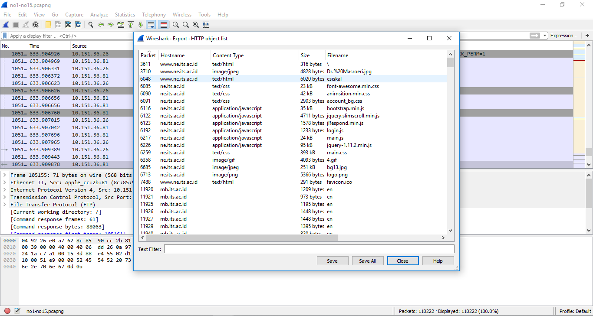

	- Pada bagian `Find` cari sesuai nama file.

	- Karena tidak ada file yang bernama `ckedokteran.png`, maka hasilnya:
	
	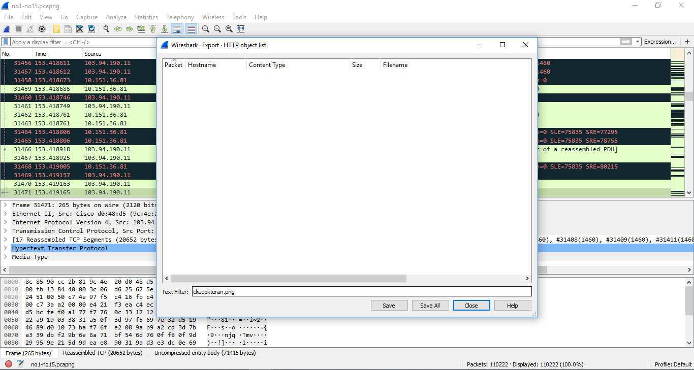
    
4.  Cari charset dari halaman "ajk.if.its.ac.id"
	
	**Jawab**:

	- Pada *display filter* gunakan *syntax* `http.host ==  "ajk.if.its.ac.id"`

	- Kemudian pilih salah satu paket, klik kanan

	- Pilih `Follow` kemudian `HTTP Stream`

	- Cari *Charset*-nya

	NB: Tidak bisa menampilkan gambar karena tidak bisa memuat hasil *filter*-nya.

    
5.  Cari username dan password ketika login di "freeshare.lp.if.its ac.id"
	
	**Jawab**:

	Ketik `http.host ==  "http://freeshare.lp.if.its.ac.id" && http.request.method == POST`. Untuk mem-filter web `"http://freeshare.lp.if.its.ac.id"` dan `http.request.method == POST`  untuk mem-filter yang login (karena login menggunakan metode POST).

	

    
6.  Sebutkan web server yang digunakan pada "[www.ne.its.ac.id](http://www.ne.its.ac.id)"
	
	**Jawab**:

7.  Sebutkan versi PHP dan yang digunakan pada "riset.ajk.if.its.ac.id"
	
	**Jawab**:

8.  Filter pada wireshark kalian sehingga menampilkan hasil ping
	
	**Jawab**:

	Filter menggunakan `icmp` pada *Display Filter*. Hasilnya seperti dibawah:

	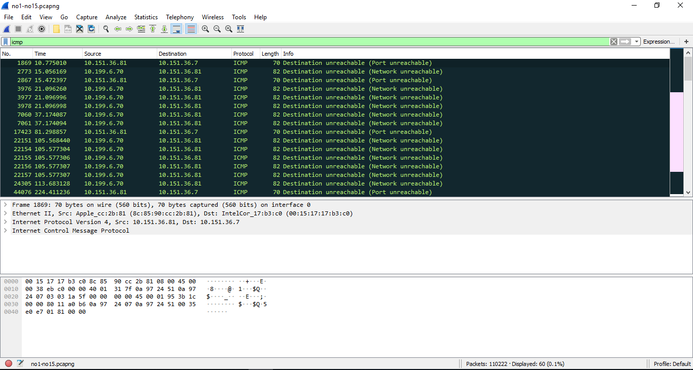
    
9.  Dapatkan semua metode GET yang mengakses "monta.if.its.ac.id"
	
	**Jawab**:

    Sama seperti soal nomor 5, bedanya pada metode. Pada nomor ini yang diminta adalah metode `GET`. Sehingga *syntax* menjadi `http.host ==  "monta.if.its.ac.id" && http.request.method == GET`. Hasilnya:

    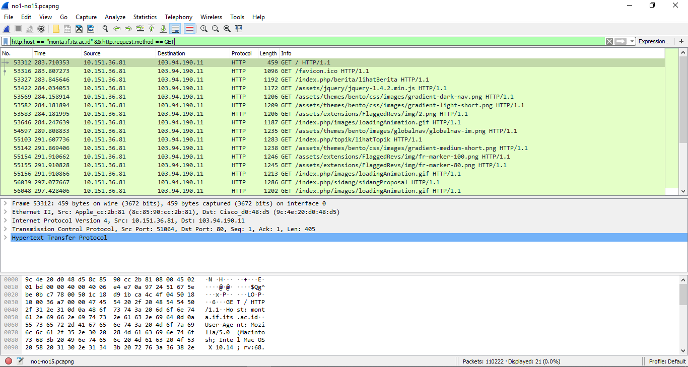

10. Tunjukkan username dan password yang dimasukkan ketika login FTP
	
	**Jawab**:

	*Syntax*-nya `ftp.request.command == "USER" || ftp.request.command == "PASS"`. Menggunakan operator 'atau' (||) untuk menampilkan *command* `USER` dan `PASS`.

	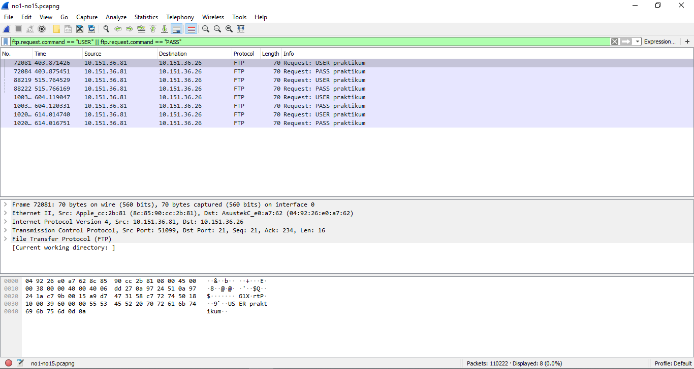	

    
11. Tunjukkan di wireshark, paket mana yang dikirimkan FTP client ketika upload file "qwpeaspojdasjfpasjfpaosuhuy.jpg"
	
	**Jawab**:

	Karena *upload*, maka menggunakan *command* `STOR`. Sehingga *syntax*-nya `ftp.request.command == STOR && ftp.request.arg == "qwpeaspojdasjfpasjfpaosuhuy.jpg"`. Akan seperti berikut:

	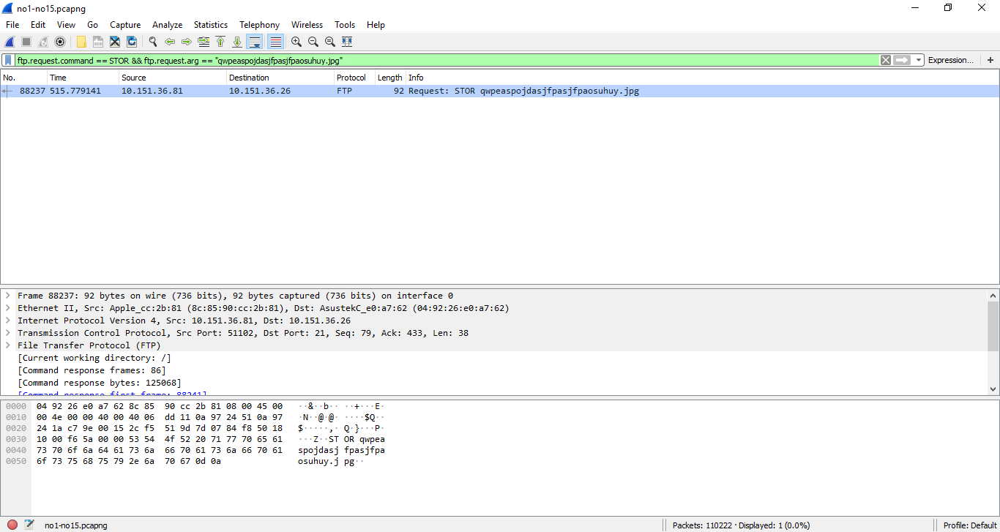

	Untuk *FTP Command and Extensions* selengkapnya bisa klik [disini](https://www.iana.org/assignments/ftp-commands-extensions/ftp-commands-extensions.xml).
    
12. Tunjukkan di wireshark, paket mana yang dikirimkan FTP client ketika menghapus file "qwpeaspojdasjfpasjfpaos.jpg"
	
	**Jawab**:

	Seperti nomor 11, bedanya pada *command* yang digunakan. Disini menggunakan `DELE` ketika menghapus file. Sehingga menjadi `ftp.request.command == DELE && ftp.request.arg == "qwpeaspojdasjfpasjfpaos.jpg"`. Berikut hasilnya:

	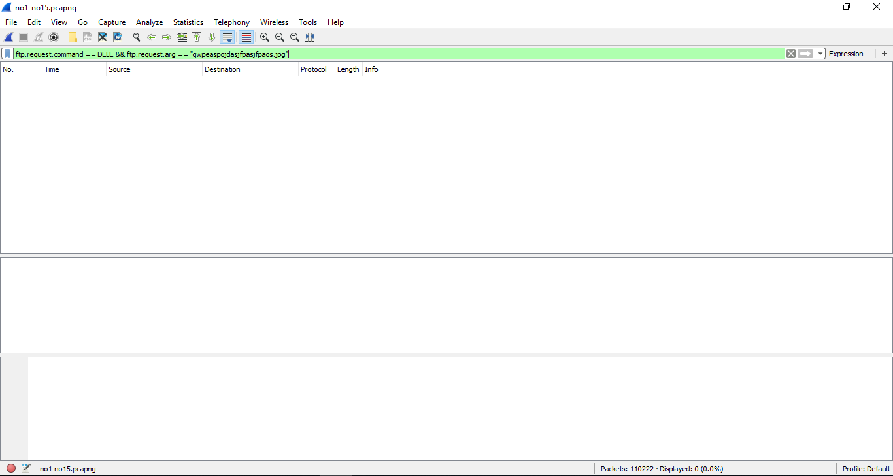
    
13. Tunjukkan di wireshark, paket mana yang dikirimkan FTP client ketika mengganti nama file "sutlin.png"
	
	**Jawab**:

	Untuk *command* mengganti nama file adalah `RNFR`. Sehingga `ftp.request.command == RNFR && ftp.request.arg == "sutlin.png"`. Hasilnya:

	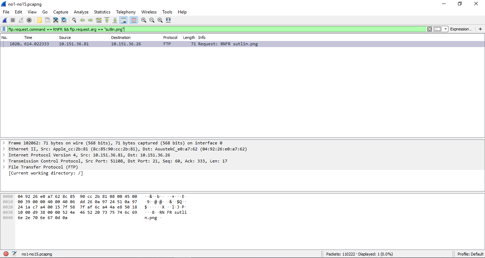
    
14. Tunjukkan di wireshark, paket mana yang dikirimkan FTP client ketika download file "sutlun.png"
	
	**Jawab**:

	Sedangkan untuk mengunduh menggunakan *command* `RETR`. *Syntax* akhir `ftp.request.command == RETR && ftp.request.arg =="sutlun.png"`. Hasilnya seperti dibawah:

    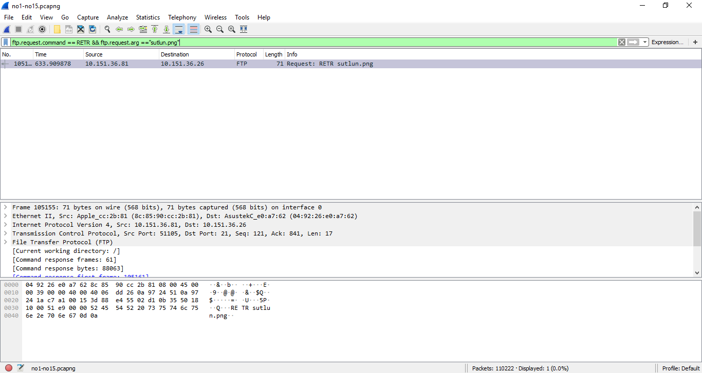

15. Cari file .zip di wireshark lalu download dan extract file tersebut

	clue "50 4B 03 04"

	**Jawab**:

